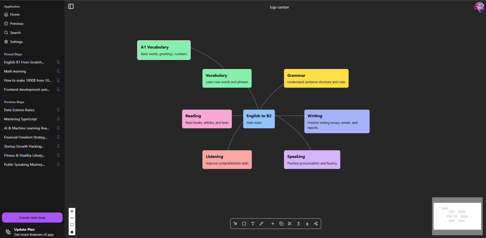

# [VicMap](https://vicmap.com)

**VicMap** is a startup that leverages AI to create **Mind Maps** and **Roadmaps**, allowing users to save, edit, and track their progress in achieving their goals.

## Description

VicMap uses advanced AI technologies to visually organize your ideas and goals. With our app, you can create and manage mind maps and roadmaps, helping you efficiently plan and track your progress.

**Features:**
- Create and edit **Mind Maps** and **Roadmaps**
- Real-time progress tracking and updates
- User-friendly interface
- Save all your maps and roadmaps for future reference

## Technologies

The project is built using the following technologies:
- **Next.js**
- **TailwindCSS**
- **Shadcn**
- **Supabase**
- **Stripe** (for payment integrations)
- **Gemini AI**
- **React Flow** (for visualizing mind maps and roadmaps)

## Access the App

Visit our [landing page](https://vicmap.com) for more information and access to the product.

## Screenshot



## Important Notice

**The source code of the app is currently under development and is not publicly available.**

## Installation and Running Locally

To run the project locally, follow these steps:

1. Clone the repository:
   ```bash
   git clone https://github.com/Vodichka500/vicmap-landing
